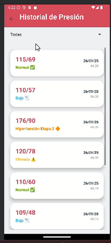
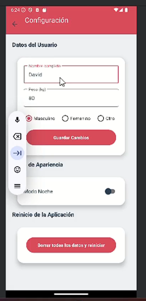
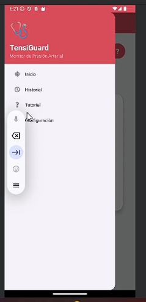

# TensiGuard

TensiGuard es una aplicación móvil Android diseñada para el monitoreo y análisis de la presión arterial utilizando inteligencia artificial a través de la API de Gemini.

---

## 🖼️ Capturas de Pantalla

| Pantalla de Bienvenida | Registro de Presión | Historial |
|------------------------|----------------------|-----------|
|  |  |  |

| Resultados de Análisis | Configuración | Modo Noche |
|------------------------|----------------|-------------|
|  |  |  |

| Barra de Navegación | Tutorial |
|---------------------|----------|
|  |  |

---

## Características Principales

- Registro y monitoreo de presión arterial
- Análisis personalizado mediante IA
- Clasificación precisa de los niveles de presión según estándares médicos
- Recomendaciones personalizadas basadas en el perfil del usuario

## Rangos de Presión Arterial

La aplicación utiliza los siguientes rangos estandarizados para clasificar la presión arterial:

- **Baja**: Sistólica < 90 mmHg o Diastólica < 60 mmHg
- **Normal**: Sistólica 90-119 mmHg y Diastólica 60-79 mmHg
- **Elevada**: Sistólica 120-129 mmHg y Diastólica < 80 mmHg
- **Hipertensión Etapa 1**: Sistólica 130-139 mmHg o Diastólica 80-89 mmHg
- **Hipertensión Etapa 2**: Sistólica 140-179 mmHg o Diastólica 90-119 mmHg
- **Crisis Hipertensiva**: Sistólica ≥ 180 mmHg o Diastólica ≥ 120 mmHg

## Tecnologías Utilizadas

- Lenguaje: Java
- Plataforma: Android
- API de IA: Google Gemini API
- Bibliotecas:
  - OkHttp: Para realizar peticiones HTTP
  - Gson: Para el manejo de JSON
  - Android AsyncTask: Para operaciones asíncronas

## Configuración del Proyecto

Para utilizar la aplicación, es necesario:

1. Obtener una API key de Google AI Studio (https://aistudio.google.com/app/api-keys)
2. Configurar la API key en el archivo `GeminiAPIService.java`
3. Asegurarse de tener los permisos de internet configurados en el AndroidManifest.xml

## Funcionalidades del Servicio GeminiAPI

El servicio `GeminiAPIService` proporciona:

- Análisis personalizado de presión arterial
- Interpretación de resultados
- Recomendaciones basadas en:
  - Presión sistólica y diastólica
  - Peso y altura del usuario
  - Género
  - Circunstancias especiales

## Formato de Respuesta

La aplicación procesa las respuestas de la IA para proporcionar:

1. Categoría exacta de presión arterial
2. Explicación personalizada de los resultados
3. Recomendaciones específicas según el perfil del usuario

## Seguridad y Privacidad

- Las comunicaciones con la API se realizan de manera segura mediante HTTPS
- Los datos del usuario se procesan localmente
- No se almacenan datos sensibles en servidores externos

## Requisitos del Sistema

- Android (versión mínima requerida por especificar)
- Conexión a Internet
- Permisos de aplicación:
- Acceso a Internet
  
# Sistema de Notificaciones (n8n)

La aplicación incluye un sistema automatizado de notificaciones mediante n8n que:

- Envía alertas por correo electrónico al médico asignado cuando:
  - Se detecta una crisis hipertensiva
  - Los valores están fuera de los rangos normales de forma consistente
  - El paciente registra síntomas preocupantes

- Envía notificaciones por Telegram que incluyen:
  - Resumen de las mediciones
  - Nivel de urgencia
  - Recomendaciones inmediatas

### Configuración de n8n

1. El workflow de n8n recibe los datos vía webhook
2. Procesa la información y determina el nivel de urgencia
3. Envía notificaciones personalizadas según la gravedad:
   - Correo electrónico al médico con detalles completos
   - Mensaje de Telegram con informacón concisa y acciones recomendadas
